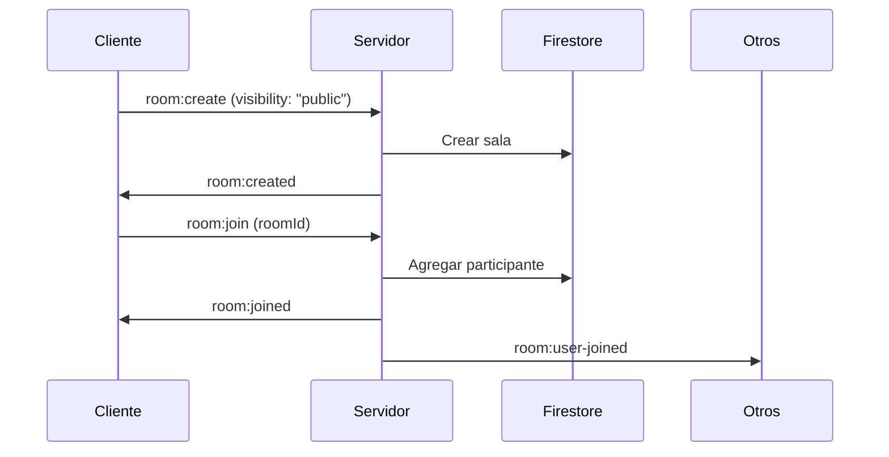
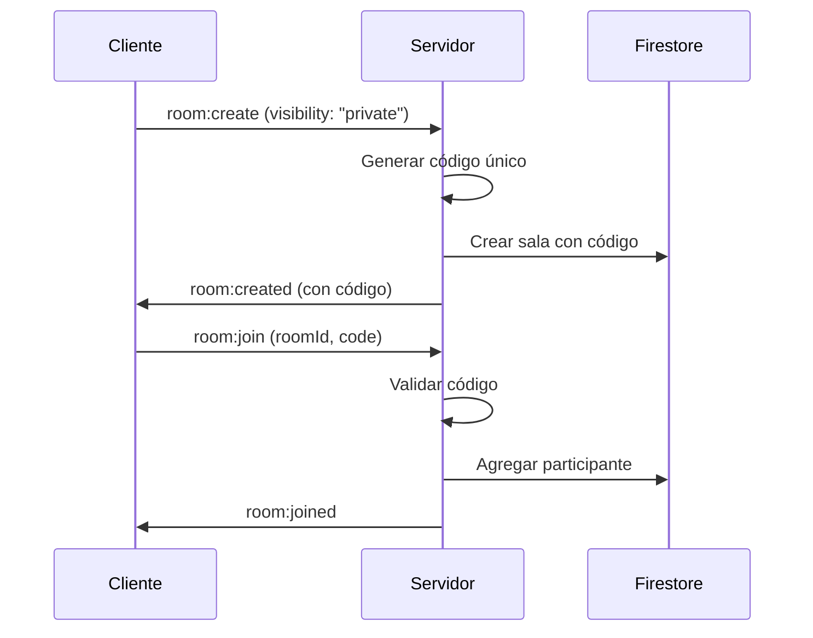
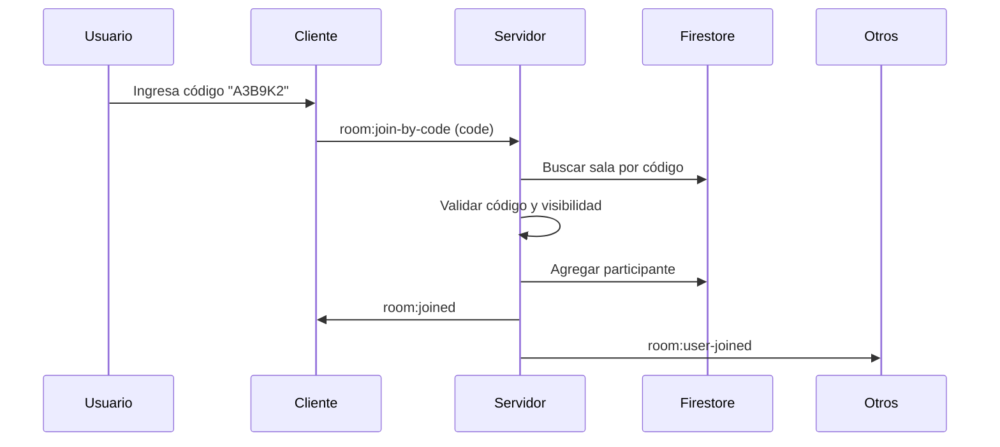
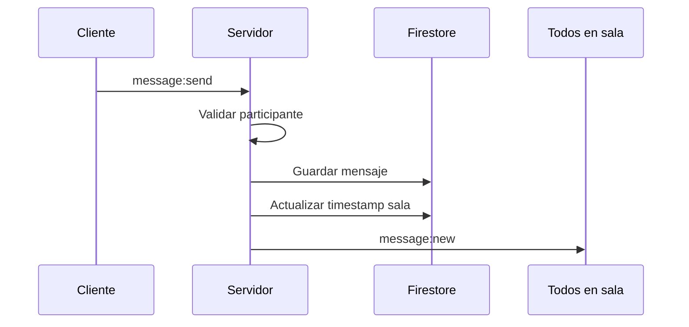

# 💬 Chat Service

Microservicio de chat en tiempo real para Nexun, construido con Socket.IO y Firebase Firestore. Proporciona funcionalidades completas de mensajería instantánea, salas de chat públicas y privadas con códigos de acceso, y gestión de participantes.

## 📋 Tabla de Contenidos

- [Descripción](#-descripción)
- [Características](#-características)
- [Arquitectura](#-arquitectura)
- [Tipos de Salas](#-tipos-de-salas)
- [Eventos Socket.IO](#-eventos-socketio)
- [Flujos de Trabajo](#-flujos-de-trabajo)
- [Estructura del Código](#-estructura-del-código)
- [Configuración](#-configuración)
- [Uso del Servicio](#-uso-del-servicio)
- [Ejemplos de Código](#-ejemplos-de-código)
- [Manejo de Errores](#-manejo-de-errores)
- [Seguridad](#-seguridad)

---

## 🎯 Descripción

El **Chat Service** es un microservicio independiente que maneja toda la lógica de comunicación en tiempo real de la aplicación Nexun. Utiliza **Socket.IO** para conexiones WebSocket bidireccionales y **Firebase Firestore** como base de datos para persistencia.

### Tecnologías Utilizadas

- **Socket.IO**: Comunicación en tiempo real bidireccional
- **Firebase Firestore**: Base de datos NoSQL para persistencia
- **Express.js**: Servidor HTTP para endpoints REST
- **TypeScript**: Tipado estático para mayor seguridad
- **Firebase Admin SDK**: Autenticación y acceso a Firestore

---

## ✨ Características

### Funcionalidades Principales

- ✅ **Chat en Tiempo Real**: Mensajería instantánea con Socket.IO
- ✅ **Salas Públicas**: Salas visibles para todos los usuarios
- ✅ **Salas Privadas**: Salas con códigos de acceso únicos (6 caracteres)
- ✅ **Múltiples Tipos de Salas**: Direct (1-1), Group, Channel
- ✅ **Gestión de Participantes**: Agregar/remover usuarios de salas
- ✅ **Historial de Mensajes**: Persistencia en Firestore con paginación
- ✅ **Presencia de Usuarios**: Detección de usuarios online/offline
- ✅ **Cache en Memoria**: Optimización de consultas frecuentes (TTL: 30s)
- ✅ **Autenticación**: Middleware de autenticación con Firebase tokens

### Tipos de Mensajes Soportados

- **text**: Mensajes de texto plano
- **image**: Imágenes
- **file**: Archivos
- **system**: Mensajes del sistema

---

## 🏗️ Arquitectura

### Estructura del Servicio

```
chat-service/
├── src/
│   ├── index.ts              # Punto de entrada, configuración del servidor
│   ├── controllers/
│   │   └── chatController.ts # Manejo de eventos Socket.IO
│   └── services/
│       └── chatService.ts    # Lógica de negocio y acceso a datos
├── swagger.json              # Documentación OpenAPI
└── README.md                 # Esta documentación
```

### Flujo de Datos

```
Cliente (Frontend)
    ↓
Socket.IO Connection
    ↓
socketAuthMiddleware (Autenticación)
    ↓
ChatController (Eventos)
    ↓
ChatService (Lógica de Negocio)
    ↓
Firebase Firestore (Persistencia)
```

### Componentes Principales

#### 1. **ChatController** (`controllers/chatController.ts`)
- Maneja todos los eventos Socket.IO
- Gestiona conexiones/desconexiones de usuarios
- Valida permisos y autenticación
- Emite eventos a los clientes

#### 2. **ChatService** (`services/chatService.ts`)
- Lógica de negocio del chat
- Operaciones CRUD en Firestore
- Generación de códigos únicos para salas privadas
- Cache en memoria para optimización
- Validaciones y transformaciones de datos

#### 3. **Socket.IO Server** (`index.ts`)
- Configuración del servidor WebSocket
- Middleware de autenticación
- Gestión de conexiones

---

## 🏠 Tipos de Salas

### 1. Salas Públicas (`visibility: "public"`)

**Características:**
- Visibles para todos los usuarios
- Aparecen en la lista de salas disponibles
- Cualquier usuario puede unirse sin restricciones
- No requieren código de acceso

**Uso:**
```typescript
// Crear sala pública
socket.emit("room:create", {
  name: "General Chat",
  type: "group",
  visibility: "public"
});
```

### 2. Salas Privadas (`visibility: "private"`)

**Características:**
- Solo visibles para participantes
- Requieren código de acceso único (6 caracteres alfanuméricos)
- El código se genera automáticamente al crear la sala
- Solo usuarios con el código pueden unirse

**Uso:**
```typescript
// Crear sala privada
socket.emit("room:create", {
  name: "Private Meeting",
  type: "group",
  visibility: "private"
});

// Respuesta incluye el código
socket.on("room:created", (room) => {
  console.log("Room code:", room.code); // Ej: "A3B9K2"
});
```

### Tipos de Salas por Propósito

#### **Direct** (1-1)
- Conversación privada entre dos usuarios
- Generalmente privada por defecto

#### **Group**
- Grupo de usuarios con propósito específico
- Puede ser pública o privada

#### **Channel**
- Canal de comunicación abierto
- Generalmente pública

---

## 📡 Eventos Socket.IO

### Eventos Cliente → Servidor

#### `room:create`
Crea una nueva sala de chat.

**Payload:**
```typescript
{
  name: string;                    // Nombre de la sala (requerido)
  description?: string;             // Descripción opcional
  type: "direct" | "group" | "channel";  // Tipo de sala (requerido)
  visibility: "public" | "private";      // Visibilidad (requerido)
  participants?: string[];          // IDs de usuarios iniciales (opcional)
}
```

**Respuesta:** `room:created`
```typescript
{
  id: string;
  name: string;
  type: "direct" | "group" | "channel";
  visibility: "public" | "private";
  code?: string;                    // Solo presente si es privada
  participants: string[];
  createdBy: string;
  createdAt: Date;
  updatedAt: Date;
}
```

**Errores:**
- `VALIDATION_ERROR`: Faltan campos requeridos
- `CREATE_ROOM_ERROR`: Error al crear la sala

---

#### `room:join`
Se une a una sala existente.

**Payload:**
```typescript
{
  roomId: string;                   // ID de la sala (requerido)
  code?: string;                    // Código de acceso (requerido para privadas)
}
```

**Respuesta:** `room:joined`
```typescript
{
  roomId: string;
  room: ChatRoom;
}
```

**Errores:**
- `CODE_REQUIRED`: Código requerido para salas privadas
- `INVALID_CODE`: Código de acceso incorrecto
- `ROOM_NOT_FOUND`: Sala no encontrada

---

#### `room:join-by-code`
Se une a una sala privada usando solo el código de acceso.

**Payload:**
```typescript
{
  code: string;                     // Código de acceso (6-8 caracteres)
}
```

**Respuesta:** `room:joined`
```typescript
{
  roomId: string;
  room: ChatRoom;
}
```

**Errores:**
- `INVALID_CODE_FORMAT`: Formato de código inválido
- `ROOM_NOT_FOUND`: No se encontró sala con ese código
- `NOT_PRIVATE_ROOM`: El código no corresponde a una sala privada

---

#### `room:leave`
Abandona una sala.

**Payload:**
```typescript
{
  roomId: string;
}
```

**Respuesta:** `room:left`
```typescript
{
  roomId: string;
}
```

---

#### `message:send`
Envía un mensaje a una sala.

**Payload:**
```typescript
{
  roomId: string;                   // ID de la sala (requerido)
  content: string;                  // Contenido del mensaje (requerido)
  type?: "text" | "image" | "file"; // Tipo de mensaje (default: "text")
  metadata?: Record<string, unknown>; // Metadatos adicionales
}
```

**Respuesta:** `message:new` (emitido a todos en la sala)
```typescript
{
  id: string;
  roomId: string;
  senderId: string;
  senderName: string;
  senderPicture?: string;
  content: string;
  timestamp: Date;
  type: "text" | "image" | "file" | "system";
  metadata?: Record<string, unknown>;
}
```

**Errores:**
- `ROOM_NOT_FOUND`: Sala no encontrada
- `NOT_PARTICIPANT`: Usuario no es participante de la sala

---

#### `messages:get`
Obtiene mensajes de una sala con paginación.

**Payload:**
```typescript
{
  roomId: string;                   // ID de la sala (requerido)
  limit?: number;                   // Número de mensajes (default: 50)
  lastMessageId?: string;          // ID del último mensaje para paginación
}
```

**Respuesta:** `messages:list`
```typescript
{
  roomId: string;
  messages: ChatMessage[];
}
```

---

#### `room:get`
Obtiene detalles de una sala específica.

**Payload:**
```typescript
roomId: string;  // ID de la sala
```

**Respuesta:** `room:details`
```typescript
ChatRoom;  // Detalles completos de la sala
```

---

### Eventos Servidor → Cliente

#### `rooms:list`
Lista de salas disponibles para el usuario (se envía automáticamente al conectar).

**Payload:**
```typescript
ChatRoom[];  // Array de salas (públicas + privadas del usuario)
```

---

#### `room:created`
Emitido cuando se crea una nueva sala (solo para salas públicas, se emite a todos).

**Payload:**
```typescript
ChatRoom;  // Sala creada (sin código si no eres el creador)
```

---

#### `room:user-joined`
Notificación cuando un usuario se une a una sala.

**Payload:**
```typescript
{
  roomId: string;
  userId: string;
  userName: string;
}
```

---

#### `room:user-left`
Notificación cuando un usuario abandona una sala.

**Payload:**
```typescript
{
  roomId: string;
  userId: string;
  userName: string;
}
```

---

#### `user:online` / `user:offline`
Notificaciones de presencia de usuarios.

**Payload:**
```typescript
{
  userId: string;
}
```

---

#### `error`
Emitido cuando ocurre un error.

**Payload:**
```typescript
{
  message: string;
  code?: string;  // Código de error específico
}
```

---

## 🔄 Flujos de Trabajo

### Flujo 1: Crear y Unirse a una Sala Pública



### Flujo 2: Crear y Unirse a una Sala Privada



### Flujo 3: Unirse con Código Directamente



### Flujo 4: Enviar Mensaje



---

## 📁 Estructura del Código

### ChatService (Lógica de Negocio)

**Métodos Principales:**

- `createRoom(data, createdBy)`: Crea una nueva sala
- `getRoom(roomId)`: Obtiene una sala por ID (con cache)
- `getRoomByCode(code)`: Busca sala por código de acceso
- `getUserRooms(userId)`: Obtiene salas del usuario (públicas + privadas)
- `addParticipant(roomId, userId)`: Agrega participante a sala
- `removeParticipant(roomId, userId)`: Remueve participante de sala
- `saveMessage(message)`: Guarda mensaje en Firestore
- `getMessages(roomId, limit, lastMessageId)`: Obtiene mensajes con paginación
- `isParticipant(roomId, userId)`: Verifica si usuario es participante

**Cache:**
- Cache de salas individuales (TTL: 30 segundos)
- Cache de listas de salas públicas (TTL: 30 segundos)

### ChatController (Manejo de Eventos)

**Métodos Principales:**

- `handleConnection(socket)`: Maneja nueva conexión
- `handleCreateRoom(socket, data)`: Crea sala
- `handleJoinRoom(socket, data)`: Une usuario a sala
- `handleJoinByCode(socket, data)`: Une por código
- `handleLeaveRoom(socket, data)`: Usuario abandona sala
- `handleSendMessage(socket, data)`: Envía mensaje
- `handleGetMessages(socket, data)`: Obtiene mensajes
- `handleGetRoom(socket, roomId)`: Obtiene detalles de sala

**Tracking de Usuarios:**
- `connectedUsers`: Map de userId → Set de socketIds
- Permite múltiples conexiones del mismo usuario

---

## ⚙️ Configuración

### Variables de Entorno

```env
# Puerto del servicio
CHAT_SERVICE_PORT=3002

# Orígenes CORS permitidos (separados por comas)
CORS_ORIGIN=http://localhost:3000,http://localhost:5000,http://localhost:5173

# Firebase (configurado en shared/config/firebase.ts)
FIREBASE_PROJECT_ID=your-project-id
FIREBASE_PRIVATE_KEY=your-private-key
FIREBASE_CLIENT_EMAIL=your-client-email
```

### Firestore Collections

- **`rooms`**: Salas de chat
  - Campos: `id`, `name`, `description`, `type`, `visibility`, `code`, `participants`, `createdBy`, `createdAt`, `updatedAt`
  
- **`messages`**: Mensajes de chat
  - Campos: `id`, `roomId`, `senderId`, `senderName`, `senderPicture`, `content`, `timestamp`, `type`, `metadata`

- **`users`**: Perfiles de usuario
  - Campos: `uid`, `displayName`, `email`, `photoURL`

### Índices Recomendados en Firestore

```json
{
  "indexes": [
    {
      "collectionGroup": "rooms",
      "queryScope": "COLLECTION",
      "fields": [
        { "fieldPath": "visibility", "order": "ASCENDING" },
        { "fieldPath": "updatedAt", "order": "DESCENDING" }
      ]
    },
    {
      "collectionGroup": "rooms",
      "queryScope": "COLLECTION",
      "fields": [
        { "fieldPath": "code", "order": "ASCENDING" }
      ]
    },
    {
      "collectionGroup": "rooms",
      "queryScope": "COLLECTION",
      "fields": [
        { "fieldPath": "visibility", "order": "ASCENDING" },
        { "fieldPath": "participants", "arrayConfig": "CONTAINS" },
        { "fieldPath": "updatedAt", "order": "DESCENDING" }
      ]
    },
    {
      "collectionGroup": "messages",
      "queryScope": "COLLECTION",
      "fields": [
        { "fieldPath": "roomId", "order": "ASCENDING" },
        { "fieldPath": "timestamp", "order": "DESCENDING" }
      ]
    }
  ]
}
```

---

## 🚀 Uso del Servicio

### Iniciar el Servicio

```bash
# Desarrollo
npm run dev:chat

# Producción
npm run build:chat
npm run start:chat
```

### Conectar desde el Frontend

```typescript
import { io } from "socket.io-client";

// Obtener token de Firebase Auth
const token = await user.getIdToken();

// Conectar al servicio (a través del API Gateway)
const socket = io("http://localhost:3000/api/chat", {
  auth: {
    token: token
  },
  transports: ["websocket", "polling"]
});

// Escuchar eventos
socket.on("connect", () => {
  console.log("Connected to chat service");
});

socket.on("rooms:list", (rooms) => {
  console.log("Available rooms:", rooms);
});
```

---

## 💻 Ejemplos de Código

### Ejemplo 1: Crear Sala Pública

```typescript
// Crear sala pública
socket.emit("room:create", {
  name: "General Discussion",
  description: "Chat general para todos",
  type: "group",
  visibility: "public"
});

// Escuchar respuesta
socket.on("room:created", (room) => {
  console.log("Sala creada:", room);
  // room.code será undefined para salas públicas
});
```

### Ejemplo 2: Crear Sala Privada

```typescript
// Crear sala privada
socket.emit("room:create", {
  name: "Team Meeting",
  type: "group",
  visibility: "private"
});

// Escuchar respuesta con código
socket.on("room:created", (room) => {
  console.log("Sala privada creada:", room);
  console.log("Código de acceso:", room.code); // Ej: "A3B9K2"
  
  // Compartir código con otros usuarios
  shareRoomCode(room.code);
});
```

### Ejemplo 3: Unirse a Sala Pública

```typescript
// Unirse sin código
socket.emit("room:join", {
  roomId: "room-id-123"
});

socket.on("room:joined", ({ roomId, room }) => {
  console.log(`Unido a sala: ${room.name}`);
});
```

### Ejemplo 4: Unirse a Sala Privada con Código

```typescript
// Opción 1: Unirse con roomId y código
socket.emit("room:join", {
  roomId: "room-id-123",
  code: "A3B9K2"
});

// Opción 2: Unirse solo con código (más fácil)
socket.emit("room:join-by-code", {
  code: "A3B9K2"
});

socket.on("room:joined", ({ roomId, room }) => {
  console.log(`Unido a sala privada: ${room.name}`);
});
```

### Ejemplo 5: Enviar Mensaje

```typescript
socket.emit("message:send", {
  roomId: "room-id-123",
  content: "Hola, ¿cómo están?",
  type: "text"
});

// Escuchar mensajes nuevos (todos en la sala)
socket.on("message:new", (message) => {
  console.log(`${message.senderName}: ${message.content}`);
  displayMessage(message);
});
```

### Ejemplo 6: Obtener Historial de Mensajes

```typescript
// Obtener últimos 50 mensajes
socket.emit("messages:get", {
  roomId: "room-id-123",
  limit: 50
});

socket.on("messages:list", ({ roomId, messages }) => {
  messages.forEach(message => {
    displayMessage(message);
  });
});

// Paginación: obtener mensajes anteriores
socket.emit("messages:get", {
  roomId: "room-id-123",
  limit: 50,
  lastMessageId: "oldest-message-id"
});
```

### Ejemplo 7: React Hook Completo

```typescript
import { useEffect, useState } from "react";
import { io, Socket } from "socket.io-client";

interface ChatRoom {
  id: string;
  name: string;
  visibility: "public" | "private";
  code?: string;
}

export const useChatService = (token: string) => {
  const [socket, setSocket] = useState<Socket | null>(null);
  const [rooms, setRooms] = useState<ChatRoom[]>([]);
  const [connected, setConnected] = useState(false);

  useEffect(() => {
    const newSocket = io("http://localhost:3000/api/chat", {
      auth: { token },
      transports: ["websocket", "polling"]
    });

    newSocket.on("connect", () => {
      setConnected(true);
    });

    newSocket.on("rooms:list", (roomsList) => {
      setRooms(roomsList);
    });

    newSocket.on("room:created", (room) => {
      setRooms(prev => [...prev, room]);
    });

    setSocket(newSocket);

    return () => {
      newSocket.close();
    };
  }, [token]);

  const createRoom = (data: {
    name: string;
    type: "direct" | "group" | "channel";
    visibility: "public" | "private";
  }) => {
    socket?.emit("room:create", data);
  };

  const joinRoom = (roomId: string, code?: string) => {
    socket?.emit("room:join", { roomId, code });
  };

  const joinByCode = (code: string) => {
    socket?.emit("room:join-by-code", { code });
  };

  const sendMessage = (roomId: string, content: string) => {
    socket?.emit("message:send", { roomId, content });
  };

  return {
    socket,
    rooms,
    connected,
    createRoom,
    joinRoom,
    joinByCode,
    sendMessage
  };
};
```

---

## ⚠️ Manejo de Errores

### Códigos de Error Comunes

| Código | Descripción | Solución |
|--------|-------------|----------|
| `UNAUTHORIZED` | Usuario no autenticado | Verificar token de Firebase |
| `VALIDATION_ERROR` | Campos requeridos faltantes | Verificar payload del evento |
| `ROOM_NOT_FOUND` | Sala no existe | Verificar roomId o código |
| `CODE_REQUIRED` | Código requerido para sala privada | Proporcionar código en `room:join` |
| `INVALID_CODE` | Código incorrecto | Verificar código de acceso |
| `INVALID_CODE_FORMAT` | Formato de código inválido | Código debe ser 6-8 caracteres alfanuméricos |
| `NOT_PARTICIPANT` | Usuario no es participante | Unirse a la sala primero |
| `NOT_PRIVATE_ROOM` | Código no corresponde a sala privada | Verificar código |

### Ejemplo de Manejo de Errores

```typescript
socket.on("error", (error) => {
  switch (error.code) {
    case "CODE_REQUIRED":
      showCodeInput();
      break;
    case "INVALID_CODE":
      showError("Código de acceso incorrecto");
      break;
    case "ROOM_NOT_FOUND":
      showError("Sala no encontrada");
      break;
    default:
      showError(error.message || "Error desconocido");
  }
});
```

---

## 🔒 Seguridad

### Autenticación

- Todos los eventos requieren autenticación mediante Firebase tokens
- El middleware `socketAuthMiddleware` valida el token antes de permitir conexión
- Los tokens se verifican en cada conexión

### Validaciones

- **Códigos de acceso**: Solo alfanuméricos, 6 caracteres, únicos
- **Participantes**: Solo participantes pueden enviar mensajes
- **Salas privadas**: Requieren código válido para unirse
- **Visibilidad**: Los códigos solo se exponen a participantes

### Buenas Prácticas

1. **Nunca exponer códigos en logs públicos**
2. **Validar permisos antes de mostrar información sensible**
3. **Usar HTTPS en producción**
4. **Implementar rate limiting para prevenir abuso**
5. **Validar formato de datos en el frontend antes de enviar**

---

## 📊 Monitoreo y Health Check

### Endpoint de Health Check

```bash
GET /health
```

**Respuesta:**
```json
{
  "status": "ok",
  "service": "chat-service",
  "timestamp": "2024-01-15T10:30:00.000Z",
  "onlineUsers": 42
}
```

### Métricas Útiles

- Número de usuarios conectados
- Número de salas activas
- Mensajes por segundo
- Tiempo de respuesta de Firestore

---

## 🔗 Integración con API Gateway

El servicio está diseñado para funcionar a través del **API Gateway**:

- **URL Directa**: `http://localhost:3002`
- **URL Gateway**: `http://localhost:3000/api/chat`

El API Gateway maneja:
- Enrutamiento de WebSocket
- Proxy de conexiones Socket.IO
- CORS y autenticación

---

## 📚 Documentación Adicional

- [Swagger UI](http://localhost:3000/api-docs/chat) - Documentación interactiva
- [FRONTEND_INTEGRATION.md](../../FRONTEND_INTEGRATION.md) - Guía de integración frontend
- [ARCHITECTURE.md](../../ARCHITECTURE.md) - Arquitectura general del sistema

---

## 🐛 Troubleshooting

### Problema: No puedo conectarme al servicio

**Solución:**
1. Verificar que el servicio esté corriendo: `GET /health`
2. Verificar token de Firebase
3. Verificar configuración de CORS
4. Verificar que el API Gateway esté funcionando

### Problema: No recibo eventos

**Solución:**
1. Verificar que el socket esté conectado: `socket.connected`
2. Verificar que estés unido a la sala: `socket.rooms`
3. Verificar autenticación
4. Revisar logs del servidor

### Problema: Código de sala no funciona

**Solución:**
1. Verificar que el código sea exacto (case-insensitive)
2. Verificar que la sala sea privada
3. Verificar que el código no haya expirado (si implementaste expiración)
4. Verificar logs del servidor para errores

---

## 📝 Notas de Desarrollo

- El cache tiene un TTL de 30 segundos para balancear rendimiento y consistencia
- Los códigos se generan con 6 caracteres alfanuméricos (36^6 = ~2 billones de combinaciones)
- Las salas existentes sin `visibility` se tratan como públicas por defecto
- Los mensajes se ordenan por timestamp descendente (más recientes primero)

---

## 🤝 Contribuir

Para contribuir al desarrollo del servicio:

1. Seguir las convenciones de código TypeScript
2. Agregar tests para nuevas funcionalidades
3. Actualizar esta documentación
4. Verificar que Swagger esté actualizado

---

**Última actualización**: Enero 2024  
**Versión**: 1.0.0

